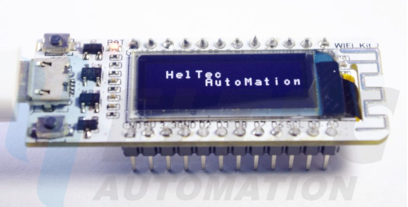
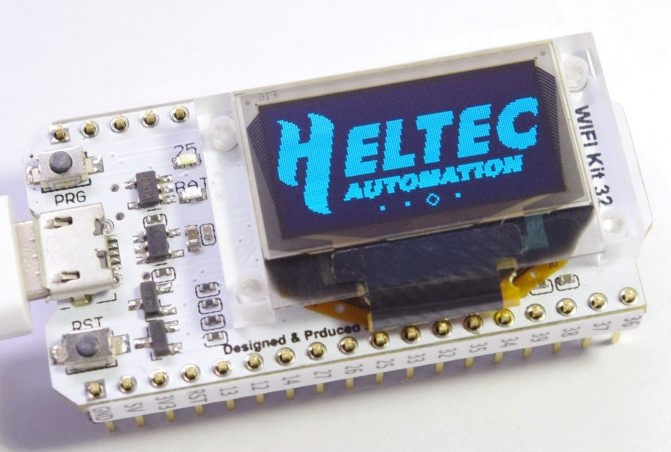
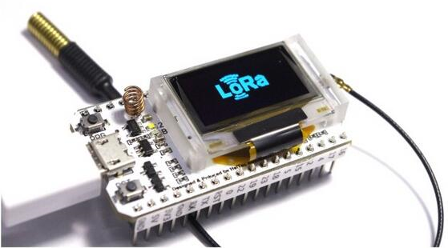

# WiFi_Kit_series Arduino Environment user guidep

## Instructions
- WIFI_Kit_32,WIFI_LoRa_32 use esp 32 chip,the source codes ang dev_environment are in [esp32](esp32/)
- WIFI_Kit_8 use esp8266 chip,the source codes ang dev_environment are in [esp8266](esp8266/)
## Contents
- [Installation Instructions](#installation-instructions)
- [Decoding Exceptions](#decoding-exceptions)
- [Issue/Bug report template](#issuebug-report-template)
- [ESP32Dev Board PINMAP](#esp32dev-board-pinmap)

## Installation Instructions

- Using Arduino IDE
  + [Instructions for Windows](windows.md)
  + [Instructions for Mac](mac.md)
  + [Instructions for Debian/Ubuntu Linux](opensuse.md)
  + [Instructions for Fedora](debian_ubuntu.md)
  + [Instructions for openSUSE](fedora.md)

#### Decoding exceptions

You can use [EspExceptionDecoder](https://github.com/me-no-dev/EspExceptionDecoder) to get meaningful call trace.

#### Issue/Bug report template
Before reporting an issue, make sure you've searched for similar one that was already created. Also make sure to go through all the issues labelled as [for reference](https://github.com/Heltec-Aaron-Lee/WiFi_Kit_series/issues?utf8=%E2%9C%93&q=is%3Aissue%20label%3A%22for%20reference%22%20).

## Important tips
- The download speed is very fast ,please use high-quality Micro USB
- Hold down the PRG key to improve download success before downloading 

## Contact us
-- website：www.heltec.cn

## Board Picture

- WIFI_Kit_8
  
- WIFI_Kit_32

  
- WIFI_LoRa_32

  

