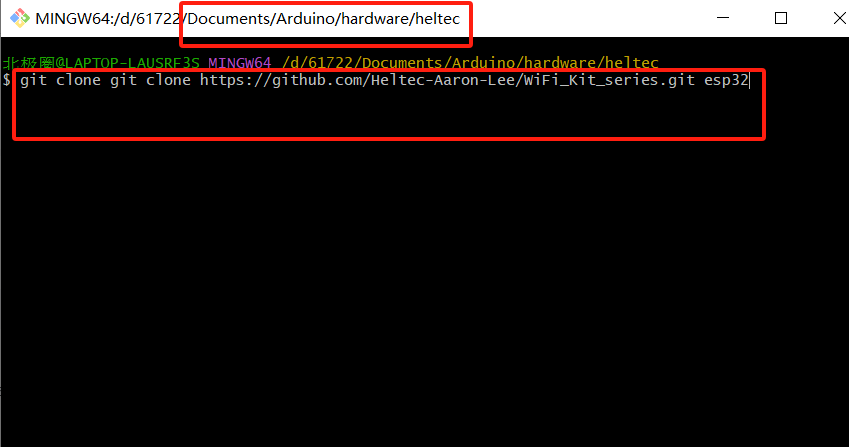
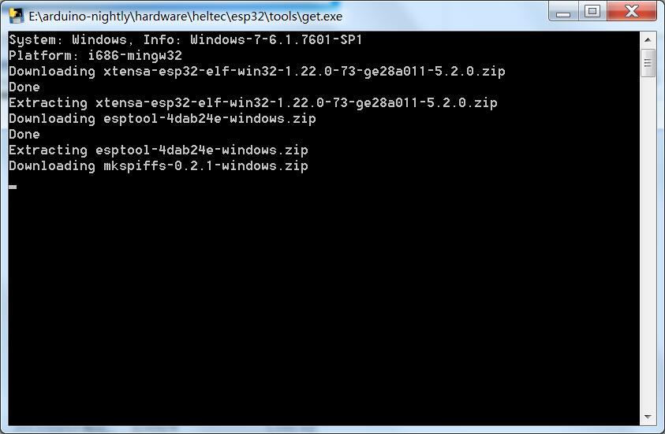
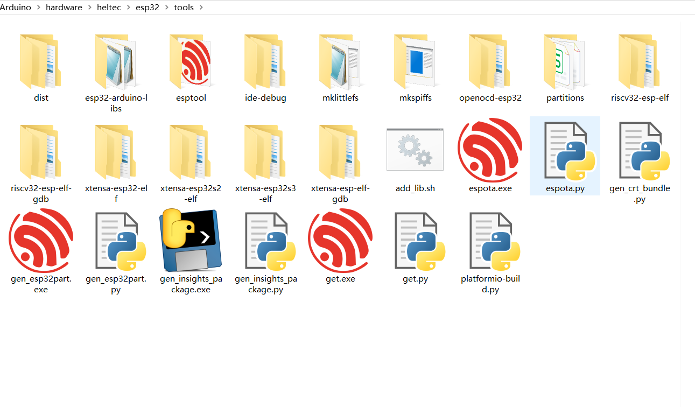
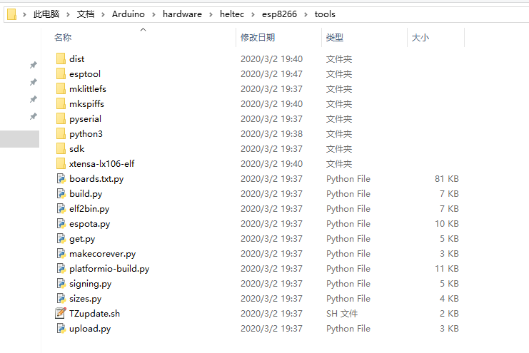
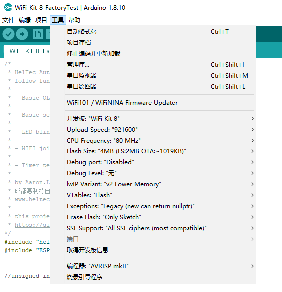
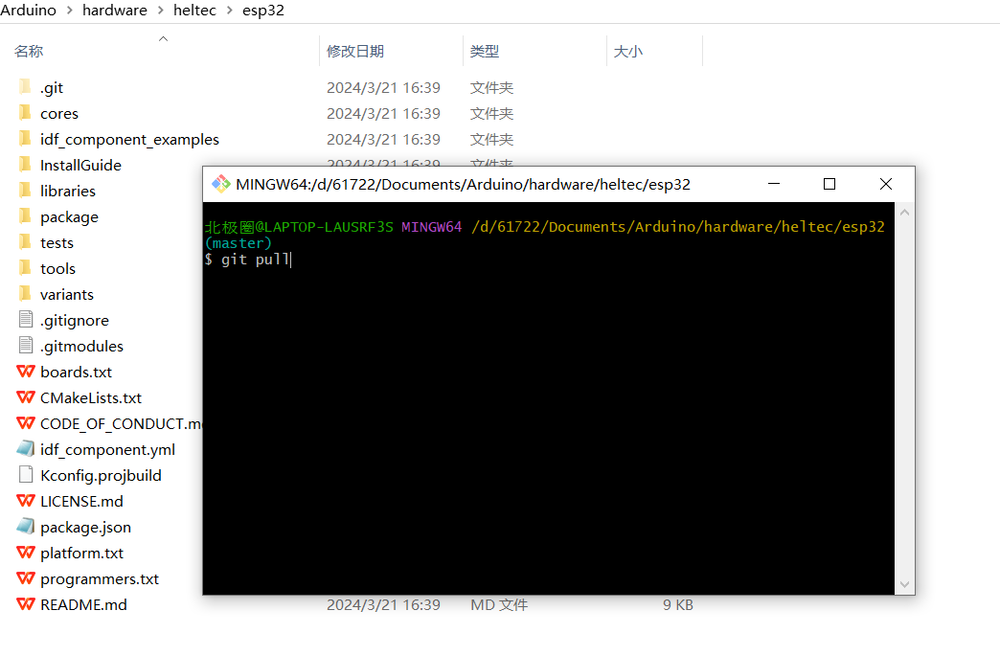

# Steps to install Heltec ESP32&ESP8266 Arduino support on Windows
**Tested on 32 and 64 bit Windows 10 machines**

Before operation, please make sure Git and Arduino are correctly installed on you computer. If not, please refer to this document: [How to install Git and Arduino IDE](https://heltec-automation-docs.readthedocs.io/en/latest/general/how_to_install_git_and_arduino.html)

&nbsp;

Executed commands **MUST** under the **user name/Documents/Arduino/hardware** path!

Start ```Git Bash``` and run through the following steps:

 - Input `git clone https://github.com/Heltec-Aaron-Lee/WiFi_Kit_series.git heltec `



## Finish Arduino ESP32 support on Windows

Open `/Documents/Arduino/hardware/heltec/esp32/tools` and double-click `get.exe`



When `get.exe` finish, the folder should like this:



Connect your ESP32 board to computer via a high quality USB cable and wait for the CP2102 drivers install automatically (or [install manually](https://heltec-automation-docs.readthedocs.io/en/latest/general/establish_serial_connection.html)).

1. Start Arduino IDE
2. Select your board in ```Tools > Board``` menu `WiFi_Kit_32` or `WiFi_LoRa_32`, etc.
3. Select the COM port that the board is attached to
4. Compile and upload (You might need to hold the ```PRG``` button while uploading)


&nbsp;


## Finish Arduino ESP8266 support on Windows
In the `/Documents/Arduino/hardware/heltec/esp8266/tools`, run the following command to finish ESP8266 tools chain install:

`python get.py`

After `get.py` running finish, the folder should like this:



Now the ESP8266 based board are available in the Arduino IDE:




## Update to the latest code

Open ```/Documents/Arduino/hardware/heltec``` created start ```Git Bash``` and input ```git pull```!



Wait for git to pull any changes and close `Git Bash`.

Open `/Documents/Arduino/hardware/heltec/esp32/tools` and double-click `get.exe`.